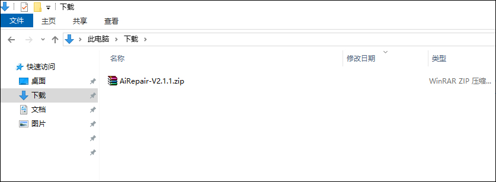
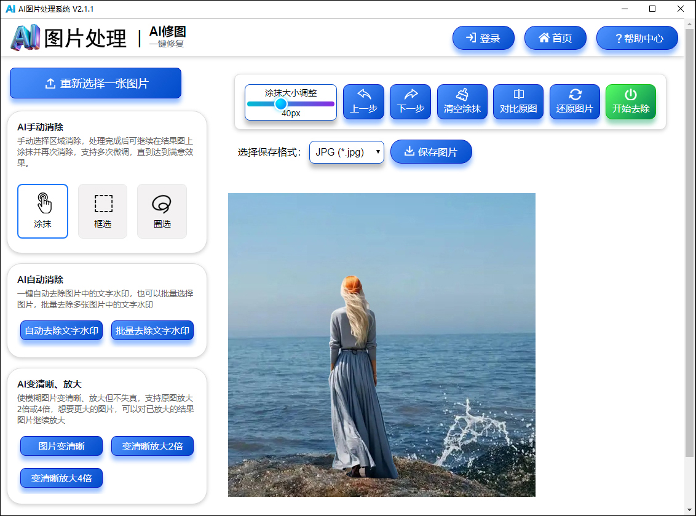

# AI一键去除水印使模糊图片变清晰放大图像修复工具AiRepair基于Python的Django模拟IOPaint采用先进的LaMa修复模型

随着人工智能技术的飞速发展，图像处理领域正经历着一场前所未有的深刻变革。在图像处理过程中，想要去除图片中的水印、物体或瑕疵，传统的手动处理方法往往需要繁琐的PS操作，既费时又费力。AiRepair的出现，为广大用户提供了一个高效、便捷且安全的AI智能图像处理工具。

### 什么是AiRepair（一款强大的AI图像修复神器）

  

**AiRepair** 是图像处理领域最受欢迎的AI工具之一，基于最新的AI模型处理技术，主要使用Python‌的django框架开发设计，下载后无需安装、无需联网、开箱即用，模拟IOPaint以简洁直观的Web操作界面，一键完成去除图片中的水印、人物、文字、缺陷、瑕疵、遮挡物等任何您不想要的内容，它的核心功能是利用人工智能算法，自动填充图像中被遮挡或选中的区域，使其看起来自然无痕。与传统的在线修图工具不同，AiRepair最大的亮点在于完全本地化处理，安全有保障，这意味着您的图片数据无需上传到云端，直接在本地电脑上处理，极大地保护了用户隐私。

### AiRepair的核心功能亮点

AiRepair的核心价值在于其强大的AI驱动图像处理能力，主要功能包括：

**AI涂抹：** 利用先进的LaMa模型，用户只需用画笔涂抹图片中不想要的物体（如水印、路人、障碍物、瑕疵等），AI即可自动填补背景，生成自然的图像内容，不伤原图，不损画质，结果不仅自然逼真，而且几乎看不出人工修复的痕迹。

**隐私安全第一：** 所有的AI计算均在本地完成。无论是个人照片还是商业素材，比如未发布的产品设计图，都不需要上传到第三方服务器，杜绝了数据泄露的风险，这对于处理包含个人隐私信息的照片，如证件照、家庭合影等，以及商业机密图像，都提供了可靠的安全保障。

**批量处理：** 支持批量处理功能，一次性处理海量图片，快速批量去除多张图片中的水印，减少繁琐的重复操作时间，体验AI科技带来的便利与高效。

**变清晰或放大：** 支持AI智能处理模糊图片，使模糊图片变清晰、放大，支持原图放大2倍或4倍，对放大后的图片可以再次点击放大，直到满意为止。通过AiRepair内置的图像修复和超分辨率模型，能够识别并重建图像中模糊区域的细节，一键点击即可自动完成整张图片去模糊或放大过程。

**操作简便：** 直观的涂抹操作方式，像使用橡皮擦一样简单，利用涂抹的方式精确选择消除区域，可实时调整涂抹画笔大小，涂抹结果不满意的话，可随时返回上一步涂抹操作，还可以随时对比原图与处理后的图片，支持多次微调，直到效果满意后再下载。

### 应用场景：覆盖多领域图像处理需求

AiRepair的功能强大且多样化，适用于多个领域的图像处理需求。

#### 一、摄影与图片美化领域

摄影师可以使用AiRepair修复照片中的瑕疵、多余元素或人物，使照片更加完美。例如，在拍摄旅游照片时，如果照片中出现了多余的路人或杂物，可以使用AiRepair的智能擦除功能将其移除，让照片更加干净和美观。同时，AiRepair的图像修复功能还可以修复照片中的模糊、噪点等问题，提升照片的质量。

#### 二、设计与创意领域

设计师可以利用AiRepair进行图像的创意处理，如风格转换、图像合成等，以创作出更具个性和创意的作品。例如，在制作海报、广告或包装设计时，设计师可以移除特定元素后，为二次创作留出空间。在进行电商产品图片处理时，电商从业者可以快速清理产品图背景中的杂质。

#### 三、出版与印刷领域

在出版和印刷领域，AiRepair可以用于修复和优化漫画、书籍封面、插图等图像。例如，在处理漫画图像时，它可以精准移除漫画中的文字、瑕疵，提升漫画的阅读体验。在处理书籍封面和插图时，AiRepair的图像修复功能可以修复图像中的模糊、噪点等问题，确保印刷出来的图像清晰、高质量。

### AiRepair下载

**AiRepair** 提供了一个无需安装、无需联网、开箱即用的AI图像修复工具。一键下载原版项目文件，安全无毒，支持‌在Windows7、Windows8、‌Windows10、‌Windows11电脑操作系统上运行，兼容CPU和GPU两大核心处理器，在CPU设备上也能完成基本的图像处理任务，而在GPU设备上则能获得更快的处理速度。

### AiRepair下载方法

AiRepair下载地址：https://www.pylike.com/static/airepair/AiRepair-V2.1.1.zip

**注意：** 用任意浏览器访问上面的网址，即可下载。

**下载方法详解：** 直接在浏览器地址栏内输入`https://www.pylike.com/static/airepair/AiRepair-V2.1.1.zip`，点击键盘的Enter回车键后，浏览器会直接开始下载。这里需要注意的是，有的浏览器会弹出一个下载框，询问你是否保存该文件，点击“保存”按钮后会自动将文件保存在浏览器默认的“下载”文件夹中，如下图所示。

### 打开AiRepair

如上图所示，下载后得到AiRepair-V2.1.1.zip压缩包。解压压缩包后出现一个名为“AiRepair”的文件夹，所有的项目文件都在里面，且该“AiRepair”文件夹可以被复制存放到电脑的任意位置。不需要任何安装和配置，也不要随意修改“AiRepair”文件夹内的组件。点击进入“AiRepair”文件夹后，里面有个Repair.bat启动文件，鼠标左键双击运行Repair.bat就可以打开AiRepair图像修复工具，如下图所示。

### 图片去水印过程演示

  

